# DBS302: NoSQL Database Management

## Practical 1: Setting Up Redis, MongoDB, and Cassandra — Implementing a Social Media Data Model and Contrasting Query Patterns

**Institution:** College of Science and Technology 
**Module Code:** DBS302  
**Practical Number:** 1  
**Date Submitted:** 15 May 2026  


---

## Executive Summary

This practical exercise involved the installation and configuration of three distinct NoSQL database systems—Redis, MongoDB, and Cassandra—on a local development environment using Docker containerization. A unified social media data model encompassing users, posts, and follower relationships was implemented across all three platforms to facilitate comparative analysis. The exercise demonstrated fundamental differences in data modeling philosophy, query execution patterns, and performance characteristics inherent to each NoSQL paradigm. The findings indicate that database selection for enterprise systems must be driven by specific application requirements rather than seeking a universal solution.

---

## 1. Introduction

### 1.1 Background and Motivation

NoSQL databases represent a paradigm shift from traditional relational database management systems (RDBMS), offering alternative approaches to data storage and retrieval optimized for specific use cases. The acronym "NoSQL" encompasses a diverse family of database systems including key-value stores, document stores, column-family stores, and graph databases (Cattell, 2011). Each category prioritizes different aspects of the CAP theorem—Consistency, Availability, and Partition Tolerance—leading to fundamentally different design decisions.

The three databases examined in this practical represent three distinct NoSQL categories:

1. **Redis** - An in-memory key-value store emphasizing performance
2. **MongoDB** - A document-oriented database prioritizing flexibility
3. **Cassandra** - A column-family distributed system optimizing for scalability

### 1.2 Objectives

The primary objectives of this practical were:

- To install and verify functional installations of three distinct NoSQL databases within isolated Docker containers
- To understand how each database represents data according to its underlying paradigm
- To design and implement an identical social media data model in each system
- To perform fundamental CRUD operations using database-specific interfaces
- To analyze and contrast query syntax, performance characteristics, and design patterns
- To evaluate CAP theorem trade-offs as manifested in practical implementations
- To determine optimal use cases for each database category

### 1.3 The Social Media Use Case

A social media platform was selected as the unifying use case due to its pedagogical value in demonstrating:

- **Structured entities** (user profiles with fixed and variable attributes)
- **Relationships** (follower networks requiring graph-like representations)
- **High-volume writes** (posts and updates)
- **Complex read patterns** (timeline feeds aggregating posts from multiple sources)
- **Real-time operations** (counter increments, cache requirements)

---

## 2. Setup and Installation

### 2.1 Infrastructure Setup

All three database systems were deployed using Docker Compose, enabling isolated container-based deployment without system-level configuration conflicts. This approach facilitated parallel execution of all three systems on a single development machine.

**System Requirements:**

- Docker Desktop version 26.1.4
- Docker Compose version 2.27.1
- 8GB RAM (minimum), 16GB recommended
- 10GB disk space

**Screenshot Evidence:** `03_docker_containers_running.png`

### 2.2 Docker Compose Configuration

A single `docker-compose.yml` file orchestrated the deployment of three services with appropriate port mappings and authentication credentials.

**Deployment and Verification:**

All three containers reached "Up" status successfully, with Cassandra requiring approximately 60 seconds for full initialization.

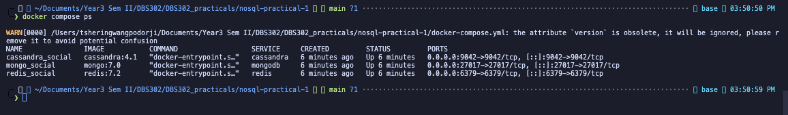

---

## 3. Part A: Redis Implementation

### 3.1 Redis Data Model Overview

Redis operates as an in-memory, single-threaded key-value store. Unlike traditional databases, Redis provides five primary data structures:

| Data Type  | Use Case               | Complexity      |
| ---------- | ---------------------- | --------------- |
| String     | Simple key-value pairs | O(1)            |
| Hash       | Object attributes      | O(1) to O(N)    |
| List       | Ordered sequences      | O(1) insert/pop |
| Set        | Unique collections     | O(1)            |
| Sorted Set | Scored members         | O(log N)        |

### 3.2 Implementation

#### 3.2.1 User Profiles (Hashes)

Users were represented as hash structures with field-value pairs containing username, name, bio, and follower counts. Retrieval demonstrated O(N) complexity where N represents the number of fields.

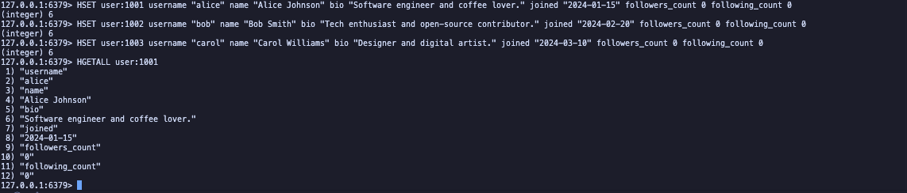

---

#### 3.2.2 Follower Relationships (Sets)

Set data structures tracked following and follower relationships with efficient O(1) membership testing and O(N) retrieval operations. Follower counts were atomically updated in user hash structures.

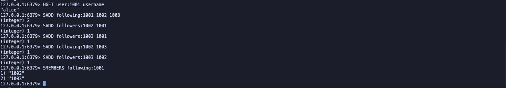

---

#### 3.2.3 Posts and Timelines (Lists)

Posts were stored as hash structures; timelines used list data structures for chronological ordering. List operations returned items in insertion order with O(S+N) complexity for range retrieval of the most recent posts.

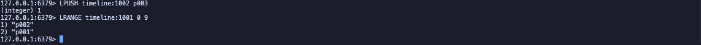

---

#### 3.2.4 News Feed (Sorted Sets)

Sorted sets enabled timestamp-based ordering with automatic sorting by score. Reverse range queries efficiently returned feed in reverse chronological order with O(log(N)+M) complexity.


---

#### 3.2.5 Like Counter (Atomic Increment)

Like counts utilized atomic increment operations ensuring data consistency at O(1) complexity per operation. Multiple simultaneous increments are guaranteed to be applied correctly without race conditions.

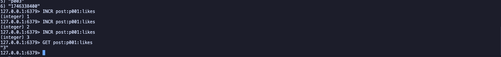

---

### 3.3 Redis Observations

**Strengths:**

- Sub-millisecond latency for all operations (in-memory execution)
- Atomic operations ensure consistency for counters
- Multiple data types provide flexibility for different access patterns
- Straightforward command interface

**Limitations:**

- No enforced schema; developers must maintain naming conventions manually
- Complex queries requiring multiple keys necessitate client-side logic
- No native relationship support; relationships modeled through separate keys
- Denormalization required; updates must cascade across multiple keys

---

## 4. Part B: MongoDB Implementation

### 4.1 MongoDB Data Model Overview

MongoDB stores data as BSON (Binary JSON) documents organized into collections. Unlike relational databases, documents within a collection need not conform to a unified schema, enabling flexible data structures that evolve with application requirements.

**Key Design Patterns:**

- **Embedding:** Nesting related data in single documents (denormalization)
- **Referencing:** Storing references to documents in other collections (normalization)

### 4.2 Implementation

#### 4.2.1 Users Collection

Users were stored as BSON documents with explicit user relationships, including reference arrays for tracking following relationships and numeric counters for followers and following counts.

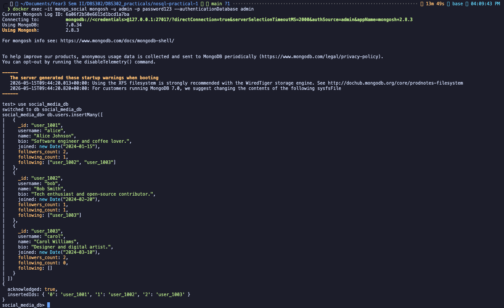

---

#### 4.2.2 Posts Collection

Posts demonstrated embedding of related subdocuments including comments as nested documents and arrays for likes and tags. This denormalization pattern optimized read performance for post retrieval with all related data.

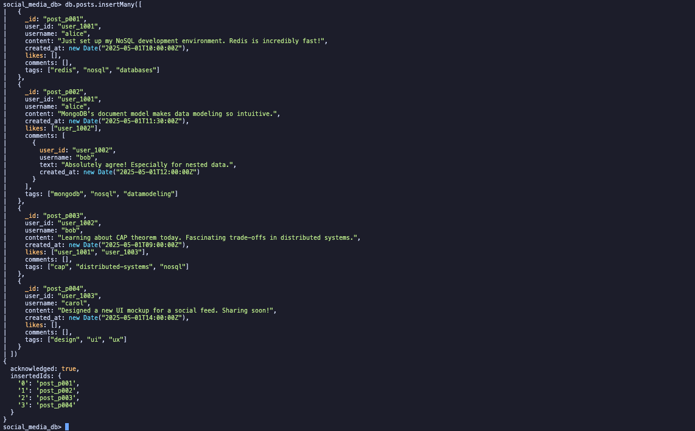

---

#### 4.2.3 Query Operations

**Basic Queries with Projections:**

Queries retrieved posts by user with optional field projection for selective retrieval of specific fields.


---


---

**Array Queries:**

Array operators enabled searching within embedded arrays, supporting tag-based queries and filtering posts based on engagement metrics.


---


---

#### 4.2.4 Update Operations

Atomic array operations enabled safe concurrent updates to posts. Likes were appended to the likes array, and comments were added as embedded subdocuments with metadata including user information and timestamps.


---


---

#### 4.2.5 Index Creation

Indexes were created on user_id for efficient document lookup, compound indexes on user_id and created_at for time-ordered retrieval, and text indexes on content and tags for full-text search capabilities.

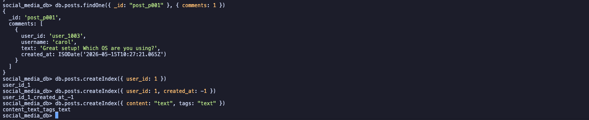

---

#### 4.2.6 Text Search

Full-text search indexes enabled sophisticated keyword-based queries across post content and tags.


---

#### 4.2.7 Aggregation Pipeline

MongoDB's aggregation framework provided powerful server-side data transformation. Multi-stage pipelines filtered posts from followed users, sorted chronologically, limited results, and computed derived fields like like and comment counts from embedded arrays.


---

### 4.3 MongoDB Observations

**Strengths:**

- Natural accommodation of nested structures (comments within posts)
- Flexible schema enabling rapid development iteration
- Powerful aggregation framework for complex transformations
- Full-text search capabilities
- ACID compliance at document level

**Limitations:**

- Denormalization in documents increases storage requirements
- Schema flexibility without validation creates consistency risks
- Indexes essential for performance; unindexed queries cause collection scans
- 16MB document size limitation

---

## 5. Part C: Cassandra Implementation

### 5.1 Cassandra Data Model Overview

Cassandra's data model fundamentally differs from both Redis and MongoDB through adherence to the principle: **Model data around queries, not entities.**

In Cassandra, the schema is the query plan. Each table is purpose-built for one specific access pattern. The primary key composition determines both data distribution and sort order:

```
PRIMARY KEY (partition_key, clustering_column1, clustering_column2, ...)
                  ↓                        ↓
         Which node stores data    How data sorted within partition
```

### 5.2 Implementation

#### 5.2.1 Keyspace Creation

A keyspace was created with SimpleStrategy replication factor of 1, appropriate for development environments. This established the namespace for all tables in the social media data model.


---

#### 5.2.2 Users Table

A simple lookup table was created with user_id as the partition key, enabling O(1) user profile retrieval. User records contained profile information including username, name, bio, and join timestamp.

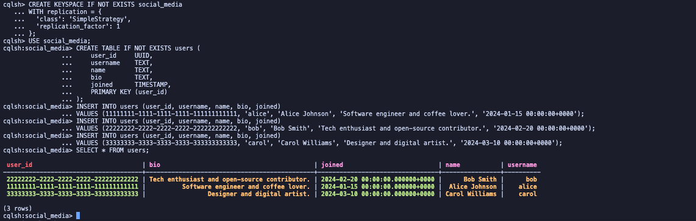

---

#### 5.2.3 Posts by User Table

This table answers the query: "Give me all posts by user X, ordered by time."

**Design Rationale:**

- **Partition Key:** `user_id` determines which node stores the data
- **Clustering Columns:** `created_at DESC` automatically sorts posts reverse-chronologically within the partition
- Results return pre-sorted without additional query-time sorting

Posts were inserted with content, tags, and engagement metadata. Query execution efficiently retrieved all posts for a user with automatic reverse-chronological ordering.


---


---

#### 5.2.4 Followers Table

A followers table was created with user_id as partition key and follower_id as clustering column, enabling efficient retrieval of all followers for a given user. Metadata included follower username and follow timestamp.

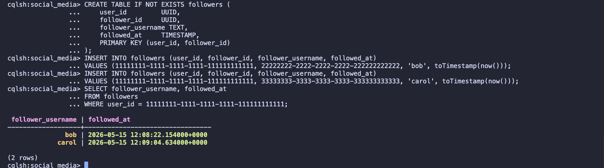

---

#### 5.2.5 Timeline Table (Denormalization Pattern)

The timeline table demonstrates Cassandra's "fan-out on write" pattern. Posts are duplicated into followers' timelines at write time, enabling O(1) read performance for timeline retrieval. When a user posts, the post is inserted into each follower's timeline with author information and engagement metadata. Timeline queries return pre-sorted results with reverse-chronological ordering.

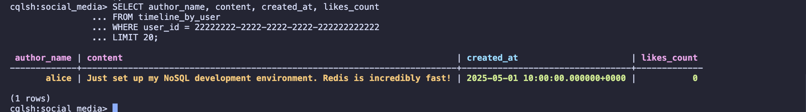

---

#### 5.2.6 Query Tracing

Cassandra's built-in tracing capability revealed query execution at the coordinator and replica level with microsecond-level timing information across multiple execution stages.

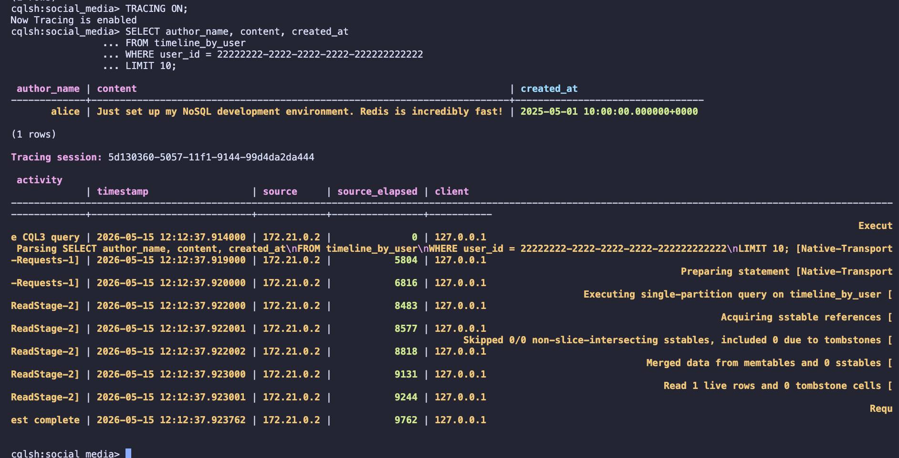

---

#### 5.2.7 Cassandra Limitations

Attempting to query by non-primary-key columns (such as username) resulted in an error. Cassandra enforces the constraint that only partition keys and clustering columns can be used in WHERE clauses. Additional query patterns require separate denormalized tables, demonstrating the query-driven design philosophy.

### 5.3 Cassandra Observations

**Strengths:**

- Extremely high write throughput (optimized for write-heavy workloads)
- Linear horizontal scalability (add nodes = linear performance increase)
- Automatic data ordering through clustering columns
- Tunable consistency (eventual consistency by default)
- Built-in tracing for performance analysis

**Limitations:**

- Query-driven schema design requires upfront planning
- No ad-hoc queries; all queries must be anticipated
- Heavy denormalization increases storage requirements
- Schema changes require careful migration planning
- ALLOW FILTERING strongly discouraged (performance antipattern)

---

## 6. Comparative Analysis

### 6.1 Data Modeling Philosophy Comparison

| Aspect              | Redis                    | MongoDB                  | Cassandra                        |
| ------------------- | ------------------------ | ------------------------ | -------------------------------- |
| **Organization**    | Flat key-value pairs     | Nested BSON documents    | Partitioned rows with clustering |
| **Schema**          | None (manual discipline) | Optional (flexible)      | Strict (DDL required)            |
| **Relationships**   | Manual via separate keys | Embedding or referencing | Denormalization                  |
| **Design Approach** | Application-driven       | Entity-driven            | Query-driven                     |
| **Nesting Support** | Multiple keys required   | Native subdocuments      | Collections (SET, LIST, MAP)     |

### 6.2 Query Pattern Comparison

The same logical query—"Retrieve the 10 most recent posts from a specific user"—exhibits different expression patterns:

**Redis:**

```redis
LRANGE timeline:1001 0 9
```

- Returns list of post IDs only
- Requires second round-trip to retrieve post content
- Complexity: O(S+N)

**MongoDB:**

```javascript
db.posts.find({ user_id: "user_1001" }).sort({ created_at: -1 }).limit(10);
```

- Returns complete post documents
- Single query returns all needed data
- Complexity: O(log N + K) with index

**Cassandra:**

```cassandra
SELECT * FROM posts_by_user
WHERE user_id = 11111111-1111-1111-1111-111111111111
LIMIT 10;
```

- Returns pre-sorted data directly from partition
- Clustering columns handle sorting
- Single efficient partition scan

### 6.3 Write vs. Read Trade-offs

| Scenario                             | Redis          | MongoDB              | Cassandra                       |
| ------------------------------------ | -------------- | -------------------- | ------------------------------- |
| Write new post                       | Fast           | Fast                 | Very Fast                       |
| Read user posts                      | Two-step       | Single query         | Single query                    |
| Build news feed                      | Manual fan-out | Aggregation pipeline | Pre-computed (fan-out on write) |
| Flexible ad-hoc queries              | Limited        | Excellent            | Very Limited                    |
| Total posts count (arbitrary filter) | Manual         | countDocuments()     | Not recommended                 |

### 6.4 Performance Characteristics

| Characteristic               | Redis              | MongoDB            | Cassandra                  |
| ---------------------------- | ------------------ | ------------------ | -------------------------- |
| Read latency (single object) | Sub-millisecond    | 1–10 ms            | 1–5 ms                     |
| Write throughput             | Very High          | High               | Extremely High             |
| Data persistence             | Optional (RDB/AOF) | Always on disk     | Always on disk (LSM tree)  |
| Horizontal scalability       | Cluster (limited)  | Sharding           | Linear (add nodes)         |
| Memory footprint             | High (in-memory)   | Moderate           | Low (disk-based)           |
| Strong consistency           | Yes (single node)  | Yes (configurable) | Tunable (eventual default) |

### 6.5 CAP Theorem Positioning

**Redis:** CP (Configurable)

- Prioritizes consistency and partition tolerance
- Eventual consistency with replication

**MongoDB:** CP (Configurable)

- Strong consistency within replica sets
- Tunable through write concern levels

**Cassandra:** AP (Tunable)

- Prioritizes availability and partition tolerance
- Eventual consistency by default
- Consistency tunable through consistency levels

---

## 7. Selection Criteria for Database Choice

### 7.1 Use Case Recommendations

| Use Case                   | Recommended Database | Justification                                 |
| -------------------------- | -------------------- | --------------------------------------------- |
| Session storage            | Redis                | Sub-millisecond latency, TTL support          |
| Caching                    | Redis                | In-memory performance, expiration policies    |
| User profiles              | MongoDB              | Flexible schema, variable attributes          |
| Ad-hoc analytics           | MongoDB              | Aggregation pipeline, complex queries         |
| Event logging              | Cassandra            | High write throughput, linear scalability     |
| Pre-computed timelines     | Cassandra            | Denormalization efficiency, fan-out pattern   |
| Geographically distributed | Cassandra            | Multi-region replication, tunable consistency |

### 7.2 Social Media Platform Architecture Recommendation

For a production social media platform serving millions of users, a **polyglot persistence architecture** would be optimal:

```
┌─────────────────────────────────────┐
│         User Request                 │
└────────────┬────────────────────────┘
             │
    ┌────────┴─────────┬────────────────┐
    │                  │                 │
    ▼                  ▼                 ▼
[Redis Cache]    [Cassandra]        [MongoDB]
    │            Social Data        Analytics/
    │            Posts, Timelines   Reporting
    │            Followers
    │
Session           High-volume
Authentication    Writes
Real-time         Linear Scale
Counters
```

**Rationale:**

1. **Redis** handles:
   - Session authentication (< 100ms required)
   - Real-time like counters
   - Rate limiting
   - Temporary data with expiration

2. **Cassandra** stores:
   - All social data (posts, timelines, followers)
   - Handles write-heavy load (posts, likes)
   - Scales linearly with user growth
   - Pre-computed timelines via denormalization

3. **MongoDB** supports:
   - Analytics queries (off-peak processing)
   - User preferences (flexible schema)
   - Admin audit logs
   - Reporting requirements

---

## 8. Key Lessons Learned

### 8.1 Fundamental Insights

1. **No Universal Solution:** Each database optimizes for specific trade-offs. Selection must be driven by application requirements, not general preference.

2. **Schema as Query Plan:** Cassandra's "model around queries" philosophy differs fundamentally from entity-driven approaches. This requires upfront design but enables predictable performance.

3. **Denormalization Consequences:** All three systems employ denormalization to varying degrees. The cost manifests differently:
   - Redis: Manual key management
   - MongoDB: Document size and consistency burden
   - Cassandra: Storage overhead but performance benefit

4. **Index Criticality:** MongoDB demonstrated that unindexed queries cause full collection scans. Index strategy is essential for production systems.

5. **Consistency Models:** The CAP theorem is not theoretical—its trade-offs manifest in practical constraints:
   - Redis: Single-threaded atomicity for consistency
   - MongoDB: Configurable write concern for consistency tuning
   - Cassandra: Tunable consistency levels for AP positioning

### 8.2 Practical Observations

1. **Development Speed:** MongoDB's flexibility accelerates early development but requires discipline to prevent data quality issues.

2. **Operational Simplicity:** Redis's single-threaded model simplifies reasoning about consistency but limits scalability.

3. **Distributed System Complexity:** Cassandra's distributed nature requires understanding of partitioning, replication, and eventual consistency—significantly more operational complexity.

4. **Query Performance Patterns:**
   - Redis: Fast for simple lookups, inefficient for complex queries
   - MongoDB: Consistent performance across query types with proper indexing
   - Cassandra: Extremely fast for designed query patterns, impossible for unplanned queries

---

## 9. Conclusion

This practical successfully demonstrated the implementation and comparative analysis of three NoSQL database paradigms. The social media use case effectively illustrated the fundamental differences in data modeling, query execution, and performance characteristics.

**Key Findings:**

1. Redis excels as a high-performance cache and session store but lacks the query flexibility for complex data requirements.

2. MongoDB provides an optimal balance between flexibility and performance, making it suitable for general-purpose applications where schema evolution is expected.

3. Cassandra represents the ultimate optimization for specific use cases—write-heavy, globally distributed systems with predictable query patterns.

The selection of a NoSQL database must be driven by specific application requirements:

- **If consistency and simplicity are paramount:** Consider MongoDB
- **If write performance and scalability are critical:** Choose Cassandra
- **If sub-millisecond latency and temporal data are required:** Use Redis

For production systems, polyglot persistence—combining multiple databases for their respective strengths—represents best practice rather than attempting to force a single system into all roles.

